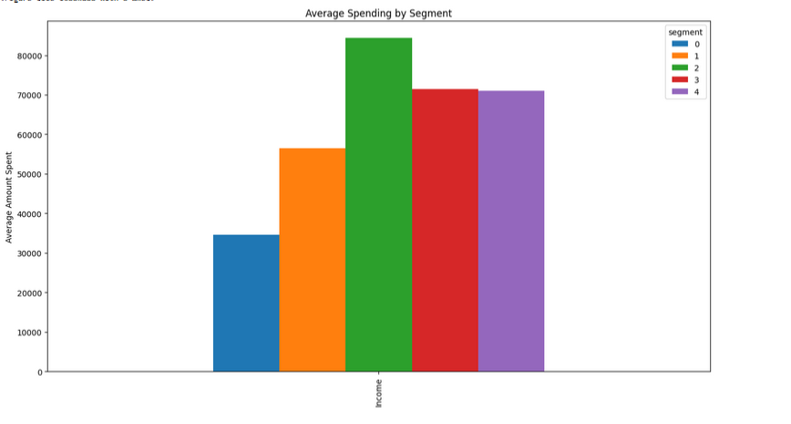
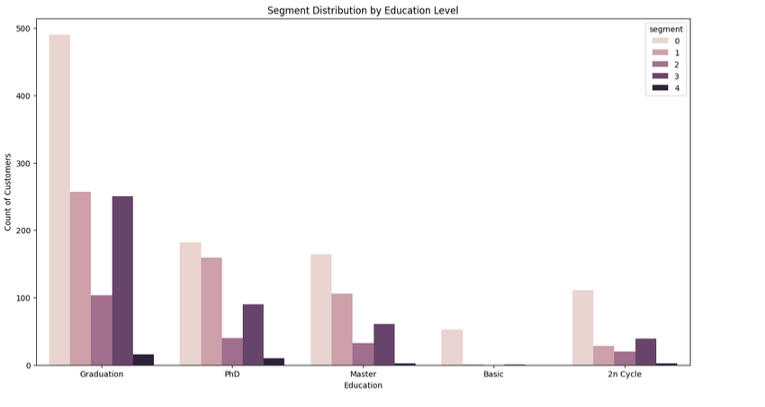
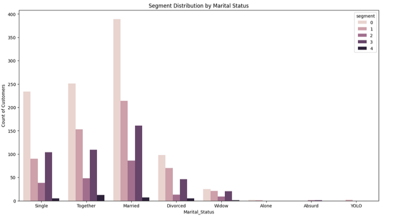
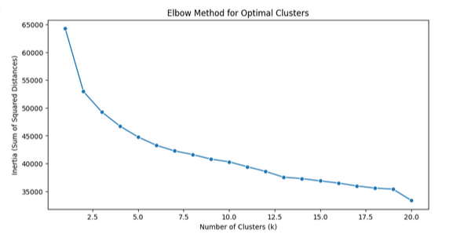
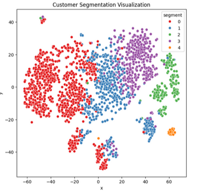

# Customer Segmentation using KMeans Clustering
This repository contains a project that implements KMeans clustering for customer segmentation. The dataset used in this project is processed, cleaned, and visualized to provide insights into customer behavior and patterns based on various features like education level, marital status, spending patterns, and more.

## Project Overview
The project aims to segment customers based on various features using **KMeans clustering**. The goal is to identify distinct customer groups that can be targeted with personalized marketing strategies.
## Technologies Used
- Python 3.x
- Libraries:
  - `pandas` for data manipulation
  - `numpy` for numerical operations
  - `matplotlib` and `seaborn` for data visualization
  - `sklearn` for machine learning (KMeans clustering and preprocessing)

## Dataset
The dataset used in this project is a CSV file . It contains various customer-related features such as spending habits, marital status, education level, and more.

### Data Cleaning:
- Missing values were handled by dropping rows with null values.
- Categorical features (Education, Marital Status) were label encoded for clustering.
- Some columns were dropped to focus on the relevant features.

## Methods
- **KMeans Clustering**: The dataset is clustered into different segments based on the features provided.
- **StandardScaler**: Used to scale the data before clustering.
- **Elbow Method**: Used to determine the optimal number of clusters (k).
- **Silhouette Score**: Used to validate the clustering quality.
## Results

### 1. **Segment Distribution by Income**  
The following chart shows how the income levels are distributed across different clusters. It helps to identify if income is a significant factor for clustering.

### 2. **Segment Distribution by Education Level**  
This visualization shows how each segment is distributed across different education levels. We can observe patterns that link education with specific customer segments.

### 3. **Segment Distribution by Marital Status**  
Here, the marital status of customers is analyzed across segments, revealing how customer relationships correlate with other features in the dataset.

### 4. **Elbow Method for Optimal k**  
The elbow method plot below shows how the inertia decreases as the number of clusters increases. The "elbow" point indicates the optimal number of clusters for segmentation.

### 5. **Cluster Visualization **  
This shows the clusters after using KMeans algorithm. It helps visualize data points are separated among different segments.

